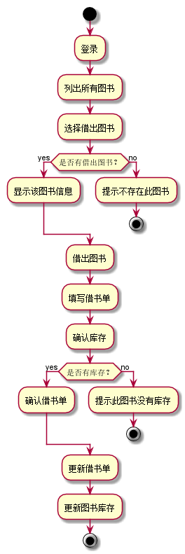
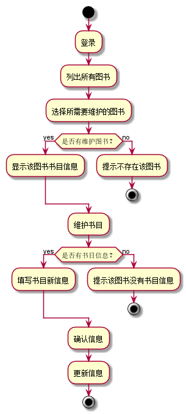
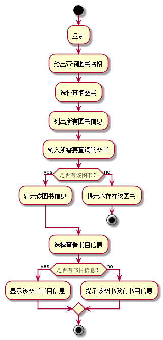
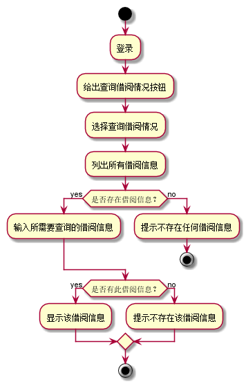
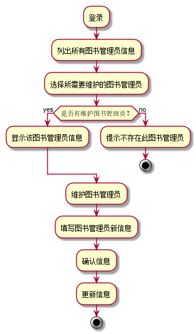

# 实验2：图书管理系统用例建模
|学号|班级|姓名|
|:-------:|:-------------: | :----------:|
|201510414302|软件(本)15-3|杜芸彦|

## 1. 图书管理系统的用例关系图

### 1.1 用例图PlantUML源码如下：

``` usecase
@startuml
  left to right direction
  图书管理员 --> (借出图书)
  图书管理员 -->(归还图书)
  图书管理员 --> (维护书目)
  图书管理员 --> (维护读者信息)
  读者 --> (查询书目)
  (查询借阅情况)<-- 读者
  (预定图书)<-- 读者
  (维护书目) .> (查询书目) : include
  (维护读者信息) .> (查询借阅情况) : include
  (预定图书) .> (取消预定) : extends
  超级管理员 --|> 图书管理员
  超级管理员 --> (维护图书管理员信息)
@enduml
```

### 1.2. 用例图如下：


## 2. 参与者说明：

###     2.1 图书管理员

主要职责是：查询图书、查询借阅情况、借出图书 、归还图书 、维护书目 、维护读者信息

###     2.2 读者

主要职责是：查询书目、查询借阅情况、预定图书、取消预定

###     2.3 超级管理员

主要职责是：维护图书管理员信息、借出图书、归还图书 、维护书目 、维护读者信息

##     3. 用例规约表

###     3.1 “借出图书”用例

|用例名称|借出图书|
|:-------|:-------------|
|参与者|图书管理员、超级管理员（以下简称管理员）|
|前置条件|管理员登录到系统|
|后置条件|产生借书单，更新图书信息并存储|
|主时间流|
|参与者动作|系统行为|
|2.管理员选择所需要借出的图书<br>4.管理员选择借出图书<br>5.管理员填写借出图书的日期和数量<br>7.管理员确认借书单填写完毕，进行保存|1.系统列出所有图书的名称<br>3.系统显示该图书的所有信息<br>6.系统确认借出图书有库存<br>8.系统保存借书单<br>9.系统更新借出图书的库存，用例结束|
|备选事件流|
|2a.没有借出图书<br>&nbsp;&nbsp;&nbsp;&nbsp;1.系统提示不存在借出图书，用例结束<br>6a.图书库存不足<br>&nbsp;&nbsp;&nbsp;&nbsp;1.系统提示图书库存不足，转第5步<br>7a.管理员选择重填<br>&nbsp;&nbsp;&nbsp;&nbsp;1.系统清空所有输入，转第2步|
|业务规则|
|1.每个借书单所借出的图书总数量不能超过20本<br>2.每个借书单只能对应一个读者<br>3.每个借出单可以有多种图书，图书有名称、ISBN、作者、出版社、价格和借出数量等，应能支持选择输入图书名称、ISBN、作者、出版社、价格|

**“借出图书”用例流程图源码如下：**
``` usecase1
@startuml
start
:登录;
:列出所有图书;
:选择借出图书;
if(是否有借出图书？) then (yes)
:显示该图书信息;
else (no)
:提示不存在此图书;
stop
endif
:借出图书;
:填写借书单;
:确认库存;
if(是否有库存？) then (yes)
:确认借书单;
else (no)
:提示此图书没有库存;
stop
endif
:更新借书单;
:更新图书库存;
stop
@enduml
```

**“借出图书”用例流程图如下：**



###     3.2 “归还图书”用例

|用例名称|归还图书|
|:-------|:-------------|
|参与者|图书管理员、超级管理员（以下简称管理员）|
|前置条件|管理员登录到系统|
|后置条件|图书归还，更新借书单和图书信息并存储|
|主时间流|
|参与者动作|系统行为|
|2.管理员选择归还的图书的借书单<br>4.管理员选该借书单中的归还图书<br>5.管理员归还该图书<br>6.管理员填写归还图书的日期和数量<br>8.管理员确认借书单更新完毕，进行保存|1.系统列出所有借书单的信息<br>3.系统显示该借书单的所有信息<br>7.系统比对归还图书的数量和借出图书的数量，若相等，则显示已归还，若不等，则显示此图书已归还x本<br>9.系统保存新的借书单<br>10.系统更新归还图书的库存，用例结束|
|备选事件流|
|2a.没有该归还图书的借书单 <br>&nbsp;&nbsp;&nbsp;&nbsp;1.系统提示不存在此借书单，用例结束<br>5a.归还超期<br>&nbsp;&nbsp;&nbsp;&nbsp;1.系统提示已超期，开始扣费，用例结束<br>8a.管理员选择重填<br>&nbsp;&nbsp;&nbsp;&nbsp;1.系统清空所有输入，转第2步|
|业务规则|
|1.图书归还后，在借书单中此图书显示已归还<br>2.归还的图书只能对应一个借书单<br>3.归还的图书可以选择数量，应能支持数量的选择<br>4.不同的图书可以选择不同的日期归还，不一定一次性归还完|

**“归还图书”用例流程图源码如下：**
``` usecase2
@startuml
start
:登录;
:列出所有借书单;
:选择归还图书的借书单;
if(是否有该借书单？) then (yes)
:显示该借书单信息;
else (no)
:提示不存在此借书单;
stop
endif
:归还图书;
if(归还是否超期？) then (yes)
:开始扣费;
stop
else (no)
:填写归还图书的数量;
endif
if(是否与借出数量相等？) then (yes)
:更新借书单;
else (no)
:显示已归还x本;
endif
:确认借书单;
:更新图书库存;
stop
@enduml
```

**“归还图书”用例流程图如下：**


###     3.3 “维护书目”用例

|用例名称|维护书目|
|:-------|:-------------|
|参与者|图书管理员、超级管理员（以下简称管理员）|
|前置条件|管理员登录到系统|
|后置条件|更新书目信息并存储|
|主时间流|
|参与者动作|系统行为|
|2.管理员选择所需要维护的图书<br>4.管理员选择维护书目<br>5.管理员填写图书书目的新信息<br>6.管理员确认信息填写完毕，进行保存|1.系统列出所有图书的信息<br>3.系统显示该图书的书目信息<br>7.系统保存新的书目信息<br>8.系统更新书目信息，用例结束|
|备选事件流|
|2a.没有该图书信息<br>&nbsp;&nbsp;&nbsp;&nbsp;1.系统提示不存在此图书，用例结束<br>3a.没有该图书书目信息<br>&nbsp;&nbsp;&nbsp;&nbsp;1.系统提示不存在此书目信息，用例结束<br>6a.管理员选择重填<br>&nbsp;&nbsp;&nbsp;&nbsp;1.系统清空所有输入，转第2步|
|业务规则|
|1.每本图书只能有一个书目信息<br>2.每个书目信息对应一本图书|

**“维护书目”用例流程图源码如下：**
``` usecase3
@startuml
start
:登录;
:列出所有图书;
:选择所需要维护的图书;
if(是否有维护图书？) then (yes)
:显示该图书书目信息;
else (no)
:提示不存在该图书;
stop
endif
:维护书目;
if(是否有书目信息？) then (yes)
:填写书目新信息;
else (no)
:提示该图书没有书目信息;
stop
endif
:确认信息;
:更新信息;
stop
@enduml
```

**“维护书目”用例流程图如下：**



###     3.4 “维护读者信息”用例

|用例名称|维护读者信息|
|:-------|:-------------|
|参与者|图书管理员、超级管理员（以下简称管理员）|
|前置条件|管理员登录到系统|
|后置条件|更新读者信息并存储|
|主时间流|
|参与者动作|系统行为|
|2.管理员选择所需要维护的读者<br>4.管理员选择维护读者信息<br>5.管理员填写读者的新信息<br>6.管理员确认信息填写完毕，进行保存|1.系统列出所有读者的信息<br>3.系统显示该读者的所有信息<br>7.系统保存新的读者信息<br>8.系统更新读者信息，用例结束|
|备选事件流|
|2a.没有该读者信息<br>&nbsp;&nbsp;&nbsp;&nbsp;1.系统提示不存在此读者，用例结束<br>6a.管理员选择重填<br>&nbsp;&nbsp;&nbsp;&nbsp;1.系统清空所有输入，转第2步|
|业务规则|
|1.每个读者信息对应一位读者<br>2.每个读者信息应该包含读者的姓名、性别、年龄等信息，应能支持选择输入读者的姓名、性别、年龄等信息|

**“维护读者信息”用例流程图源码如下：**
``` usecase4
@startuml
start
:登录;
:列出所有读者信息;
:选择所需要维护的读者;
if(是否有维护读者？) then (yes)
:显示该读者信息;
else (no)
:提示不存在该读者;
stop
endif
:维护读者;
:填写读者新信息;
:确认信息;
:更新信息;
stop
@enduml
```

**“维护书目”用例流程图如下：**


###     3.5 “查询书目”用例

|用例名称|查询书目|
|:-------|:-------------|
|参与者|管理员、读者|
|前置条件|管理员、读者登录到系统|
|后置条件|显示图书书目信息|
|主时间流|
|参与者动作|系统行为|
|2.管理员、读者选择查询图书<br>4.管理员、读者输入所需要查询的图书<br>6.管理员、读者选择查看书目信息|1.系统给出查询图书的按钮<br>3.系统列出所有图书信息<br>5.系统显示所查询到的图书的所有信息<br>7.系统显示图书相对应的书目信息，用例结束|
|备选事件流|
|5a.没有该图书<br>&nbsp;&nbsp;&nbsp;&nbsp;1.系统提示不存在该图书，用例结束<br>7a.没有书目信息<br>&nbsp;&nbsp;&nbsp;&nbsp;1.系统提示不存在该书目信息，用例结束|
|业务规则|
|1.每次查询只能查询一本图书的书目<br>2.图书有书名、作者、ISBN、出版社等信息，应能支持选择输入图书书名、作者、ISBN、出版社等信息|

**“查询书目”用例流程图源码如下：**
``` usecase5
@startuml
start
:登录;
:给出查询图书按钮;
:选择查询图书;
:列出所有图书信息;
:输入所需要查询的图书;
if(是否有该图书？) then (yes)
:显示该图书信息;
else (no)
:提示不存在该图书;
stop
endif
:选择查看书目信息;
if(是否有书目信息？) then (yes)
:显示该图书书目信息;
else (no)
:提示该图书没有书目信息;
endif
stop
@enduml
```

**“查询书目”用例流程图如下：**



###     3.6 “查询借阅情况”用例

|用例名称|查询借阅情况|
|:-------|:-------------|
|参与者|管理员、读者|
|前置条件|管理员、读者登录到系统|
|后置条件|显示该读者的借阅情况|
|主时间流|
|参与者动作|系统行为|
|2.管理员、读者选择查询借阅情况<br>4.管理员、读者输入所需要查询的借阅情况|1.系统给出查询借阅情况的按钮<br>3.系统显示该读者所有的借阅情况<br>5.系统显示该借阅情况的详细信息，用例结束|
|备选事件流|
|3a.不存在借阅情况<br>&nbsp;&nbsp;&nbsp;&nbsp;1.系统提示不存在借阅记录，用例结束<br>5a.不存在此借阅情况<br>&nbsp;&nbsp;&nbsp;&nbsp;1.系统提示不存在此借阅记录，用例结束|
|业务规则|
|1.每次查询只能查询一个借阅情况的详细信息<br>2.借阅记录有书名、借出时间、借出数量、是否归还等信息，应能支持选择输入图书书名、借出时间、借出数量、是否归还等信息|

**“查询借阅情况”用例流程图源码如下：**
``` usecase6
@startuml
start
:登录;
:给出查询借阅情况按钮;
:选择查询借阅情况;
:列出所有借阅信息;
if(是否存在借阅信息？) then (yes)
:输入所需要查询的借阅信息;
else (no)
:提示不存在任何借阅信息;
stop
endif
if(是否有此借阅信息？) then (yes)
:显示该借阅信息;
else (no)
:提示不存在该借阅信息;
endif
stop
@enduml
```

**“查询借阅情况”用例流程图如下：**



###     3.7 “预定图书”用例

|用例名称|预定图书|
|:-------|:-------------|
|参与者|读者|
|前置条件|读者登录到系统|
|后置条件|产生预定单并存储|
|主时间流|
|参与者动作|系统行为|
|2.读者选择所需要预定的图书<br>4.读者选择预定图书<br>5.读者填写预定图书的数量<br>6.读者确认信息填写完毕，进行保存|1.系统列出所有图书信息<br>3.系统显示图书的详细信息<br>7.系统保存预定单，用例结束|
|备选事件流|
|2a.不存在图书<br>&nbsp;&nbsp;&nbsp;&nbsp;1.系统提示不存在此图书，用例结束<br>4a.此图书已经全部借出<br>&nbsp;&nbsp;&nbsp;&nbsp;1.系统提示此图书已全部借出，不能进行预定，用例结束<br>6a.读者选择重填<br>&nbsp;&nbsp;&nbsp;&nbsp;1.系统清空所有输入，转第4步|
|业务规则|
|1.每次预定图书的总数量不能超过20本<br>2.每一个预定单只能对应一个读者<br>3.每个预定单可以有多种图书|

**“预定图书”用例流程图源码如下：**
``` usecase7
@startuml
start
:登录;
:列出所有图书;
:选择预定图书;
if(是否有预定图书？) then (yes)
:显示该图书信息;
else (no)
:提示不存在此图书;
stop
endif
:预定图书;
:填写预定单;
if(图书是否全部借出？) then (yes)
:图书已全部借出，不能进行预定;
stop
else (no)
:确认预定信息;
endif
:保存预定单;
stop
@enduml
```

**“预定图书”用例流程图如下：**


###     3.8 “取消预定”用例

|用例名称|取消预定|
|:-------|:-------------|
|参与者|读者|
|前置条件|读者登录到系统|
|后置条件|取消预定，更新预定单并存储|
|主时间流|
|参与者动作|系统行为|
|2.读者选择所需要取消图书的预定单<br>4.读者选该预定单中的所需要取消图书<br>5.读者取消预定该图书<br>6.读者确认预定单更新完毕，进行保存|1.系统列出所有预定单的信息<br>3.系统显示该预定单的所有信息<br>7.系统保存新的预定单，用例结束|
|备选事件流|
|2a.没有该取消图书的预定单<br>&nbsp;&nbsp;&nbsp;&nbsp;1.系统提示不存在此借书单，用例结束|
|业务规则|
|1.图书取消预定后，在预定单中此图书显示已取消预定<br>2.一次可以选择一本或多本图片取消预定|

**“取消预定”用例流程图源码如下：**
``` usecase8
@startuml
start
:登录;
:列出所有预定单;
:选择取消图书的预定单;
if(是否有该预定单？) then (yes)
:显示该预定单信息;
else (no)
:提示不存在此预定单;
stop
endif
:取消预定;
:确认预定单更新;
:保存新的预定单;
stop
@enduml
```

**“取消预定”用例流程图如下：**


###     3.9 “维护图书管理员”用例

|用例名称|维护图书管理员信息|
|:-------|:-------------|
|参与者|超级管理员|
|前置条件|超级管理员登录到系统|
|后置条件|更新图书管理员信息并存储|
|主时间流|
|参与者动作|系统行为|
|2.超级管理员选择所需要维护的图书管理员<br>4.超级管理员选择维护图书管理员信息<br>5.超级管理员填写读者的新信息<br>6.超级管理员确认信息填写完毕，进行保存|1.系统列出所有图书管理员的信息<br>3.系统显示该图书管理员的所有信息<br>7.系统保存新的图书管理员信息<br>8.系统更新图书管理员信息，用例结束|
|备选事件流|
|2a.没有该图书管理员信息<br>&nbsp;&nbsp;&nbsp;&nbsp;1.系统提示不存在此图书管理员，用例结束<br>6a.超级管理员选择重填<br>&nbsp;&nbsp;&nbsp;&nbsp;1.系统清空所有输入，转第2步|
|业务规则|
|1.每个图书管理员信息对应一位图书管理员<br>2.每个图书管理员信息应该包含图书管理员的姓名、性别、年龄等信息，应能支持选择输入读者的姓名、性别、年龄等信息|

**“维护图书管理员”用例流程图源码如下：**
``` usecase9
@startuml
:登录;
:列出所有图书管理员信息;
:选择所需要维护的图书管理员;
if(是否有维护图书管理员？) then (yes)
:显示该图书管理员信息;
else (no)
:提示不存在此图书管理员;
stop
endif
:维护图书管理员;
:填写图书管理员新信息;
:确认信息;
:更新信息;
stop
@enduml
```

**“维护图书管理员”用例流程图如下：**

