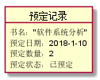
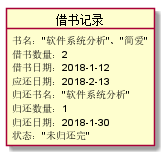
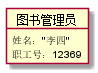

# 实验3：图书管理系统领域对象建模
|学号|班级|姓名|
|:-------:|:-------------: | :----------:|
|201510414302|软件(本)15-3|杜芸彦|

## 1. 图书管理系统的类图

### 1.1 类图PlantUML源码如下：

``` class
@startuml
class 馆藏目录{
资源目录编号
资源编号
资源名称
资源信息
}
class 馆藏资源品种{
资源编号
图书馆藏流水号
预定记录编号
资源名称
国际出版号
简介
馆藏数量
可借数量
}
class 资源项{
馆藏流水号
借书记录编号
状态
}
class 图书品种{
书名
作者
ISBN
出版社
出版日期
价格
}
class 预定记录{
预定记录编号
图书馆藏流水号
读者借书卡号
预定书名
预定日期
预定数量
预定状态（已预定/已取消）
}
class 借书记录{
借书记录编号
图书馆藏流水号
读者借书卡号
借书目录
借书数量
借书日期
归还目录
归还数量
归还日期
借书状态（未归还完/已归还完）
}
class 读者{
姓名
身份证号
借书卡号
图书限额
已借图书数
}
class 图书管理员{
职工号
姓名
}
class 逾期记录{
逾期记录编号
应归还日期（逾期开始日期）
归还日期（逾期结束日期）
逾期天数
}
class 罚款细则{
逾期天数
罚款规则
}
馆藏目录 "1" - "1..*" 馆藏资源品种
馆藏资源品种 <|-- 图书品种
馆藏资源品种 "1" - "*" 预定记录
馆藏资源品种 "1" - "*" 资源项
馆藏资源品种 *- "资源项":拥有
预定记录 "*" -- "1" 读者
资源项 "1" -- "0..1" 借书记录
借书记录 "*" -- "1" 图书管理员:登记
借书记录 "1" -- "0..1" 逾期记录
借书记录 "*" - "1" 读者
逾期记录 "*" - "0..1" 罚款细则:使用
@enduml
```

### 1.2. 类图如下：


### 1.3. 类图说明：

从此类图中，主要可以看出：本图书管理系统包含馆藏目录、馆藏资源品种、资源项、预定记录、图书品种、借书记录、读者、逾期记录、罚款细则、图书管理员这十个类。其中读者类包括读者的姓名、身份证号、借书卡号、图书限额、已借图书数、可借图书数等属性；图书类包含书名、作者、ISBN、出版社、出版日期、价格等属性；预定记录类包含预定图书的书名、预定日期、预定数量、预定状态（分为已预定/已取消预定）等属性；借书记录类包含借书目录、借书数量、借书日期、归还目录、归还数量、归还日期、借书状态（分为未归还完/已归还完）等属性；图书管理员类包含管理员职工号、姓名等属性；逾期记录类包含应归还日期（即逾期开始日期）、归还日期（即逾期结束日期）、逾期天数等属性。
读者类是由维护读者信息实例所产生，被维护读者信息实例、查询书目实例、预定图书实例、查询借阅情况实例、借出图书实例、归还图书实例所使用；图书类由维护图书信息实例产生，被维护图书信息实例、维护书目实例所使用；预定记录类由预定图书实例产生，被预定图书实例、取消预定实例所使用；借书记录类是由借出图书实例所产生，被借出图书实例、归还图书实例所使用；图书管理员类是由维护图书管理员实例产生，被维护图书管理员实例所使用；逾期记录类是由归还超期实例产生，被归还超期实例所使用。


## 2. 图书管理系统的对象图
### 2.1 读者类的对象图
#### 源码如下：
``` object1
@startuml
object 读者{
姓名："张三"
身份证号：110108199709091109
借书卡号：201201109
借书限额：20
已借图书数：10
可用限额：10
}
@enduml
```
#### 对象图如下：


### 2.2 图书类的对象图
#### 源码如下：
``` object2
@startuml
object 图书品种{
书名："软件系统分析"
ISBN：9787040126624
作者："张三"
出版社："清华大学出版社"
出版日期：2015-10
价格：50
}
@enduml
```
#### 对象图如下：


### 2.3 预定记录类的对象图
#### 源码如下：
``` object3
@startuml
object 预定记录{
书名："软件系统分析"
预定日期：2018-1-10
预定数量：2
预定状态：已预定
}
@enduml
```
#### 对象图如下：



### 2.4 借书记录类的对象图
#### 源码如下：
``` object4
@startuml
object 借书记录{
书名："软件系统分析"、"简爱"
借书数量：2
借书日期：2018-1-12
应还日期：2018-2-13
归还书名："软件系统分析"
归还数量：1
归还日期：2018-1-30
状态："未归还完"
}
@enduml
```
#### 对象图如下：



### 2.5 图书管理员类的对象图
#### 源码如下：
``` object5
@startuml
object 图书管理员{
姓名："李四"
职工号：12369
}
@enduml
```
#### 对象图如下：



### 2.6 逾期记录类的对象图
#### 源码如下：
``` object6
@startuml
object 逾期记录{
应归还日期：2018-2-26
归还日期：2018-3-8
逾期天数：9
}
@enduml
```
#### 对象图如下：


