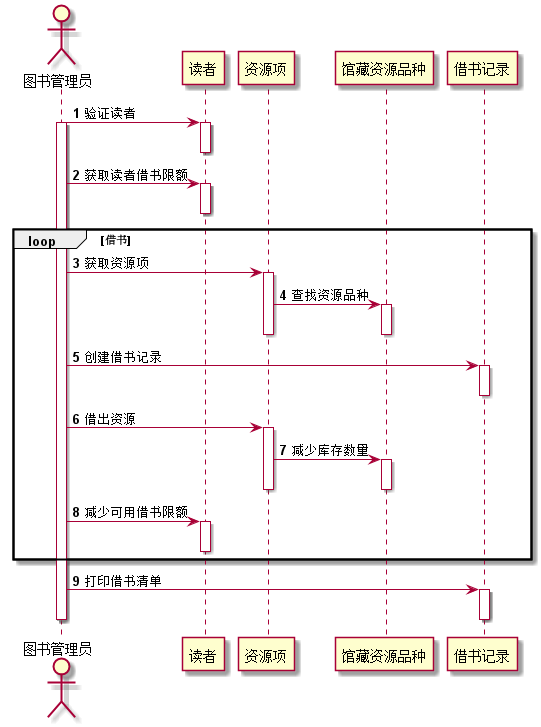
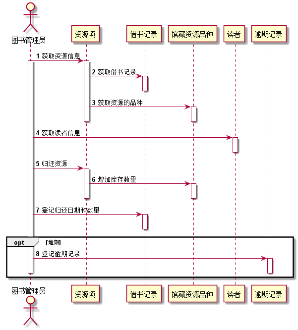
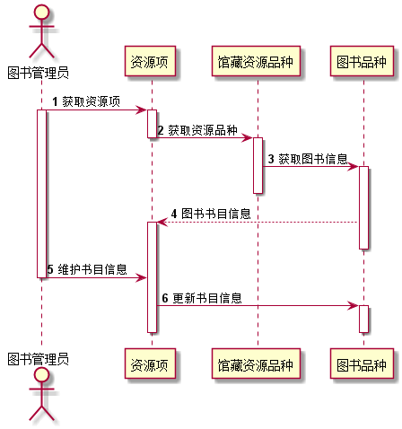
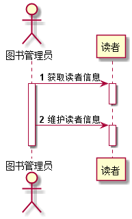
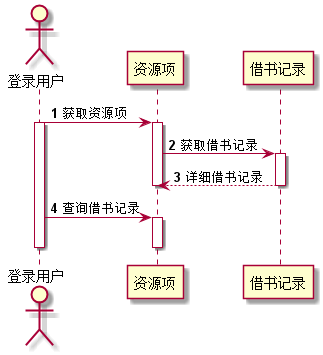
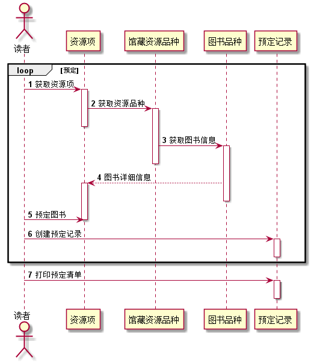
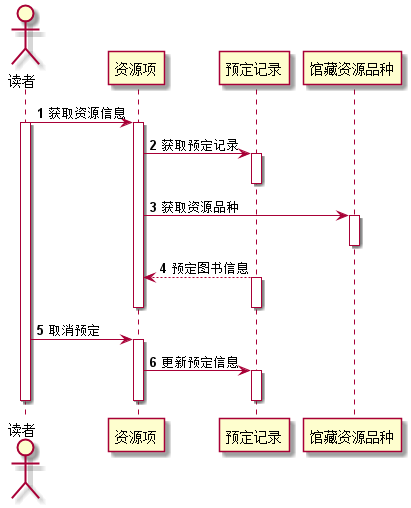

# 实验4：图书管理系统顺序图绘制
|学号|班级|姓名|
|:-------:|:-------------: | :----------:|
|201510414302|软件(本)15-3|杜芸彦|

## 图书管理系统的顺序图

## 1. 借书用例
## 1.1. 借书用例PlantUML源码

``` sequence
@startuml
actor 图书管理员
autonumber
图书管理员 -> 读者:验证读者
activate 图书管理员
activate 读者
deactivate 读者
图书管理员 -> 读者:获取读者借书限额
activate 读者
deactivate 读者
loop 借书
图书管理员 -> 资源项:获取资源项
activate 资源项
资源项 -> 馆藏资源品种:查找资源品种
activate 馆藏资源品种
deactivate 馆藏资源品种
deactivate 资源项
图书管理员 -> 借书记录:创建借书记录
activate 借书记录
deactivate 借书记录
图书管理员 -> 资源项:借出资源
activate 资源项
资源项 -> 馆藏资源品种:减少库存数量
activate 馆藏资源品种
deactivate 馆藏资源品种
deactivate 资源项
图书管理员 -> 读者:减少可用借书限额
activate 读者
deactivate 读者
end
图书管理员 -> 借书记录:打印借书清单
activate 借书记录
deactivate 借书记录
deactivate 图书管理员
@enduml
```

## 1.2. 借书用例顺序图


## 1.3. 借书用例顺序图说明
首先图书管理员验证读者信息并获取读者的借书限额，然后通过获取资源项，查找资源品种找到所需要借出的图书，之后创建借书记录，借出图书并减少库存数量，同时减少读者的可用借书限额，最后打印借书清单。如果读者同时借阅几本书，则剩下的图书将重复进行从获取资源项找到图书到减少读者借书限额的操作已完成借书任务。至此，完成借出图书用例。
***

## 2. 还书用例
## 2.1. 还书用例PlantUML源码

``` sequence
@startuml
actor 图书管理员
autonumber
图书管理员 -> 资源项:获取资源信息
activate 图书管理员
activate 资源项
资源项 -> 借书记录:获取借书记录
activate 借书记录
deactivate 借书记录
资源项 -> 馆藏资源品种:获取资源的品种
activate 馆藏资源品种
deactivate 馆藏资源品种
deactivate 资源项
图书管理员 -> 读者:获取读者信息
activate 读者
deactivate 读者
图书管理员 -> 资源项:归还资源
activate 资源项
资源项 -> 馆藏资源品种:增加库存数量
activate 馆藏资源品种
deactivate 馆藏资源品种
deactivate 资源项
图书管理员 -> 借书记录:登记归还日期和数量
activate 借书记录
deactivate 借书记录
opt 逾期
图书管理员 -> 逾期记录:登记逾期记录
activate 逾期记录
deactivate 逾期记录
deactivate 图书管理员
end
@enduml
```

## 2.2. 还书用例顺序图


## 2.3. 还书用例顺序图说明
首先图书管理员通过获取资源信息来获取归还图书的借书记录和其资源的品种，其次图书管理员将获取归还图书的读者信息，之后将归还图书资源并增加图书的库存数量，然后管理员将登记归还日期和数量，登记好后将进行归还是否逾期的判断，如果归还日期已逾期，则将进行逾期记录的登记，如果为逾期，则不进行此操作。至此，完成归还图书用例。
***

## 3. 维护书目信息用例
## 3.1. 维护书目信息用例PlantUML源码

``` sequence
@startuml
actor 图书管理员
autonumber
图书管理员 -> 资源项:获取资源项
activate 图书管理员
activate 资源项
资源项-> 馆藏资源品种:获取资源品种
deactivate 资源项
activate 馆藏资源品种
馆藏资源品种 -> 图书品种:获取图书信息
activate 图书品种
deactivate 馆藏资源品种
图书品种 --> 资源项:图书书目信息
activate 资源项
deactivate 图书品种
图书管理员 -> 资源项:维护书目信息
deactivate 图书管理员
资源项 -> 图书品种:更新书目信息
activate 图书品种
deactivate 图书品种
deactivate 资源项
@enduml
```

## 3.2. 维护书目信息用例顺序图


## 3.3. 维护书目信息用例顺序图说明
首先图书管理员通过查找资源项、资源品种来获取到所需要维护书目的图书详细信息，并将此详细信息返回到资源项，之后管理员将进行维护书目信息的操作，操作完成后，将更新图书品种中的书名信息。至此，完成维护书目信息用例。
***

## 4. 维护读者信息用例
## 4.1. 维护读者信息用例PlantUML源码

``` sequence
@startuml
actor 图书管理员
autonumber
图书管理员 -> 读者:获取读者信息
activate 图书管理员
activate 读者
deactivate 读者
图书管理员 -> 读者:维护读者信息
activate 读者
deactivate 读者
deactivate 图书管理员
@enduml
```

## 4.2. 维护读者信息用例顺序图


## 4.3. 维护读者信息用例顺序图说明
首先图书管理员将获取所需要维护的读者信息，之后进行读者信息的维护。至此，完成维护读者信息用例。
***

## 5. 查询书目信息用例
## 5.1. 查询书目信息用例PlantUML源码

``` sequence
@startuml
actor 登录用户
autonumber
登录用户 -> 资源项:获取资源项
activate 登录用户
activate 资源项
资源项 -> 馆藏资源品种:获取资源品种
deactivate 资源项
activate 馆藏资源品种
馆藏资源品种 -> 图书品种:获取图书信息
activate 图书品种
deactivate 馆藏资源品种
图书品种 --> 资源项:图书书目信息
activate 资源项
deactivate 图书品种
登录用户 -> 资源项:查询书目信息
deactivate 资源项
deactivate 登录用户
@enduml
```

## 5.2. 查询书目信息用例顺序图


## 5.3. 查询书目信息用例顺序图说明
首先登录用户（登录用户为登录此系统的用户，包括读者和图书管理员）通过查找资源项、资源品种来获取到所需要查询图书的书目信息，并将此信息返回到资源项，之后登录用户可进行查询书目信息的操作。至此，完成查询书目信息用例。
***

## 6. 查询借书记录用例
## 6.1. 查询借书记录用例PlantUML源码

``` sequence
@startuml
actor 登录用户
autonumber
登录用户 -> 资源项:获取资源项
activate 登录用户
activate 资源项
资源项 -> 借书记录:获取借书记录
activate 借书记录
借书记录 --> 资源项:详细借书记录
deactivate 借书记录
deactivate 资源项
登录用户 -> 资源项:查询借书记录
activate 资源项
deactivate 资源项
deactivate 登录用户
@enduml
```

## 6.2. 查询借书记录用例顺序图


## 6.3. 查询借书记录用例顺序图说明
首先登录用户（登录用户为登录此系统的用户，包括读者和图书管理员）通过查找资源项来获取相关借书记录并将借书记录信息返回资源项，之后登录用户可进行查询相关借书记录操作来查看借书记录的信息。至此，完成查询借书记录用例。
***

## 7. 预定图书用例
## 7.1. 预定图书用例PlantUML源码

``` sequence
@startuml
actor 读者
autonumber
loop 预定
读者 -> 资源项:获取资源项
activate 资源项
资源项 -> 馆藏资源品种:获取资源品种
activate 馆藏资源品种
deactivate 资源项
馆藏资源品种 -> 图书品种:获取图书信息
activate 图书品种
deactivate 馆藏资源品种
图书品种 --> 资源项:图书详细信息
activate 资源项
deactivate 图书品种
读者 -> 资源项:预定图书
deactivate 资源项
读者 -> 预定记录:创建预定记录
activate 预定记录
deactivate 预定记录
end
读者 -> 预定记录:打印预定清单
activate 预定记录
deactivate 预定记录
@enduml
```

## 7.2. 预定图书用例顺序图


## 7.3. 预定图书用例顺序图说明
首先读者通过查找资源项、资源品种来获取所需要预定图书的图书信息，之后读者进行预定图书的操作，并创建预定记录，如果所需要预定几本书，则重复进行以上操作，直到完成所需要预定图书的预定，然后读者可进行打印预定清单操作。至此，完成预定图书用例。
***

## 8. 取消预定用例
## 8.1. 取消预定用例PlantUML源码

``` sequence
@startuml
actor 读者
autonumber
读者 -> 资源项:获取资源信息
activate 读者
activate 资源项
资源项 -> 预定记录:获取预定记录
activate 预定记录
deactivate 预定记录
资源项 -> 馆藏资源品种:获取资源品种
activate 馆藏资源品种
deactivate 馆藏资源品种
预定记录 --> 资源项:预定图书信息
activate 预定记录
deactivate 预定记录
deactivate 资源项
读者 -> 资源项:取消预定
activate 资源项
资源项 -> 预定记录:更新预定信息
activate 预定记录
deactivate 预定记录
deactivate 资源项
deactivate 读者
@enduml
```

## 8.2. 取消预定用例顺序图


## 8.3. 取消预定用例顺序图说明
首先读者通过查找资源信息来获取预定记录和预定图书的资源品种，之后将返回预定图书信息到资源项，然后读者可进行取消预定的操作，取消预定后将对预定信息进行更新。至此，完成取消预定用例。
***