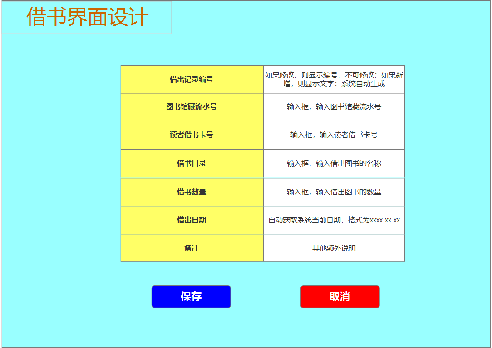

# 实验5：图书管理系统数据库设计与界面设计
|学号|班级|姓名|
|:-------:|:-------------: | :----------:|
|201510414302|软件(本)15-3|杜芸彦|

## 1.数据库表设计

## 1.1. 馆藏目录表
|字段|类型|主键，外键|可以为空|默认值|约束|说明|
|:-------:|:-------:|:-------------:|:------:|:----:|:---:|:----:|
|ResourceCatalogueID|varchar2(20)|主键|否|||资源目录编号|
|ResourceID|varchar2(20)|外键|是|||资源编号，馆藏资源品种表的外键，为空表示还没有馆藏资源|
|ResourceName|varchar2(50)| |是|||资源名称|
|ResourceInformation|varchar2(400)| |是|||资源信息，内容超过部分不保存|

## 1.2. 馆藏资源品种表
|字段|类型|主键，外键|可以为空|默认值|约束|说明|
|:-------:|:-------:|:-------------:|:------:|:----:|:---:|:----:|
|ResourceID|varchar2(20)|主键|否|||资源编号|
|SerialNumber|varchar2(20)|外键|是|||图书馆藏流水号，资源项表的外键，为空表示还没有资源项|
|ReserveID|varchar2(20)|外键|是|||预定记录编号，预定记录表的外键，为空表示还没有预定记录|
|ResourceName|varchar2(50)| |否|||资源名称|
|ISBN|varchar2(20)|外键|是|||国际出版号，图书品种表的外键，为空表示还没有图书|
|Introduction|varchar2(400)| |是|||简介，内容超过部分不保存|
|LibraryAmount|number| |是|空|取值为0-400|馆藏数量，为空表示还没有此图书|
|LoanAmount|number| |是|空|取值为0-400|可借数量，可借数量不能超过馆藏数量|

## 1.3. 图书品种表
|字段|类型|主键，外键|可以为空|默认值|约束|说明|
|:-------:|:-------:|:-------------:|:------:|:----:|:---:|:----:|
|ISBN|varchar2(20)|主键|否|||国际出版号|
|BookName|varchar2(50)| |否|||书名|
|Author|varchar2(50)| |是|||作者|
|PublishHouse|varchar2(50)| |是|||出版社|
|PublishDate|Date| |是|||出版日期，其格式为：xxxx-xx-xx|
|Price|float| |是|||价格，小数点后面保留两位|

## 1.4. 资源项表
|字段|类型|主键，外键|可以为空|默认值|约束|说明|
|:-------:|:-------:|:-------------:|:------:|:----:|:---:|:----:|
|SerialNumber|varchar2(20)|主键|否|||图书馆藏流水号|
|BorrowID|varchar2(20)|外键|是|||借书记录编号，借书记录表的外键，为空表示还没有借书记录|
|Status|char(10)| |否|剩余x本||状态，其状态为：剩余x本/全部借出/已损坏/已丢失/其他|

## 1.5. 预定记录表
|字段|类型|主键，外键|可以为空|默认值|约束|说明|
|:-------:|:-------:|:-------------:|:------:|:----:|:---:|:----:|
|ReserveID|varchar2(20)|主键|否|||预定记录编号，系统自动生成|
|SerialNumber|varchar2(20)|外键|否|||图书馆藏流水号，资源项表的外键|
|LibraryCardNumber|varchar2(20)|外键|否|||读者借书卡号，读者表的外键|
|ReserveBooks|varchar2(50)| |否|||预定书名|
|ReserveNumber|number| |否||取值为0-30|预定数量，不能超过借书限额|
|ReserveDate|Date| |是|||预定日期，其格式为：xxxx-xx-xx|
|ReservaStatus|char(8)| |是|已预定||预定状态，其状态为：已预定/已取消|

## 1.6. 借书记录表
|字段|类型|主键，外键|可以为空|默认值|约束|说明|
|:-------:|:-------:|:-------------:|:------:|:----:|:---:|:----:|
|BorrowID|varchar2(20)|主键|否|||借书记录编号，系统自动生成|
|SerialNumber|varchar2(20)|外键|否|||图书馆藏流水号，资源项表的外键|
|LibraryCardNumber|varchar2(20)|外键|否|||读者借书卡号，读者表的外键|
|BorrowBookCatalogue|varchar2(50)| |否|||借书目录|
|BorrowBookAmount|number| |否||取值为0-30|借书数量，借书数量不能超过借书限额|
|BorrowBookDate|Date| |否||其日期不能在借出书的日期之前|借书日期，其格式为：xxxx-xx-xx|
|ReturnCatalogue|varchar2(50)| |是|||归还目录|
|ReturnAmount|number| |是||取值为0-30|归还数量，归还数量不能超过借出数量|
|ReturnDate|Date| |是|||归还日期，其格式为：xxxx-xx-xx|
|BorrowBookStatus|char(10)| |是|||借书状态，其状态为：全部归还/未全部归还|

## 1.7. 读者表
|字段|类型|主键，外键|可以为空|默认值|约束|说明|
|:-------:|:-------:|:-------------:|:------:|:----:|:---:|:----:|
|Name|varchar2(50)| |否|||姓名|
|IDNumber|varchar2(20)| |是|||身份证号|
|LibraryCardNumber|varchar2(20)|主键|否|||借书卡号|
|BooksLimit|number| |否|30||图书限额|
|LoanBooks|number| |是|空||已借图书数，已借图书数不能超过图书限额|

## 1.8. 图书管理员表
|字段|类型|主键，外键|可以为空|默认值|约束|说明|
|:-------:|:-------:|:-------------:|:------:|:----:|:---:|:----:|
|WorkId|varchar2(20)|主键|否|||职工号|
|Name|varchar2(50)| |否|||姓名|

## 1.9. 逾期记录表
|字段|类型|主键，外键|可以为空|默认值|约束|说明|
|:-------:|:-------:|:-------------:|:------:|:----:|:---:|:----:|
|OverdueID|varchar2(20)|主键|否|||逾期记录编号，系统自动生成|
|StartDate|Date| |否|||应归还日期，其格式为：xxxx-xx-xx,即逾期开始日期|
|EndDate|Date| |是|||归还日期，其格式为：xxxx-xx-xx，即逾期结束日期|
|OverdueSkies|number|外键|是|空|取值为0-365|逾期天数若逾期超过365天，则表示此书丢失|

## 1.10. 罚款细则表
|字段|类型|主键，外键|可以为空|默认值|约束|说明|
|:--------:|:-------:|:-------------:|:------:|:----:|:---:|:----:|
|OverdueSkies|number|主键|否|||逾期天数|
|PenaltyClause|varchar2(400)| |否|||罚款规则，内容超过部分不保存|


***

## 2. 界面设计
## 2.1. 借书界面设计

- 用例图参见：借书用例
- 类图参见：借书记录类，读者类，资源项类
- 顺序图参见：借书顺序图
- API接口如下：

1. 借书操作接口

- 功能：按图书馆藏流水号和读者借出卡号执行借出操作
- 请求地址：  http://BookManager/v1/api/borrow_book
- 请求方法：POST
- 请求参数：

|参数名称|必填|说明|
|:-------:|:-------------: | :----------:|
|access_token|是|用于验证请求合法性的认证信息 |
|method|是|固定为 “GET”|
|version|是|客户端版本号|
|LibraryCardNumber|是|读者借书卡号|
|SerialNumber|是|图书馆藏流水号|

- 返回实例：
```
{
    "info": "借出图书成功。",
    "data": {
        "BorrowID": "6235418921",
        "SerialNumber": "153602",
        "LibraryCardNumber": "6984523167",
        "BorrowBookCatalogue": "信息系统分析与设计",
        "BorrowBookAmount": "2",
        "BorrowBookDate": "2018-5-8",
    },
    "code": 200
}
```
- 返回参数说明：
    
|参数名称|说明|
|:-------:|:-------------: |
|Info|返回提示信息|
|data|借书单信息|
|dodo|返回码|


 