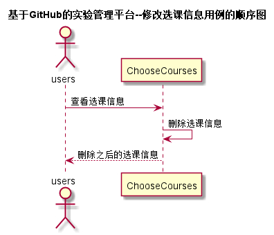

<!-- markdownlint-disable MD033-->
<!-- 禁止MD033类型的警告 https://www.npmjs.com/package/markdownlint -->

# “删除选课信息”用例 [返回](../README.md)
## 1. 用例规约

|用例名称|修改选课信息|
|-------|:-------------|
|功能|删除用户所选课程信息|
|参与者|学生，老师|
|前置条件|必须先登录|
|后置条件|显示用户删除之后的课程信息 |
|主事件流|1.用户登录系统 2.用户选择删除选课信息 3.系统显示用户所删除之后的课程信息 |
|备选事件流|2a.没有用户所需要删除的选课信息 &nbsp;&nbsp;&nbsp;&nbsp;1.系统提示：不存在该选课信息，并返回选课信息页面|

## 2. 业务流程（顺序图） [源码](../src/sequence删除选课信息.puml)

## 3. 界面设计
- 界面参照: https://d123456yy.github.io/is_analysis/test6/ui/删除选课信息.html
- API接口调用
    - 接口1：[delChooseCourses](../接口/delChooseCourses.md)

## 4. 算法描述
无

## 5. 参照表
- [STUDENTS](../数据库设计.md/#STUDENTS)
- [TEACHERS](../数据库设计.md/#TEACHERS)
- [USERS](../数据库设计.md/#USERS)
- [COURSES](../数据库设计.md/#COURSES)
- [ChooseCourses](../数据库设计.md/#ChooseCourses)
