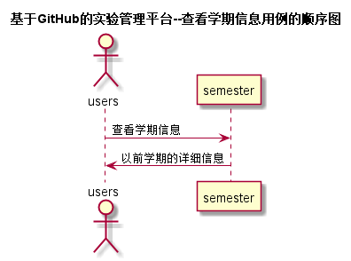

<!-- markdownlint-disable MD033-->
<!-- 禁止MD033类型的警告 https://www.npmjs.com/package/markdownlint -->

# “查看学期信息”用例 [返回](../README.md)
## 1. 用例规约

|用例名称|查看学期信息|
|-------|:-------------|
|功能|用户查看以前学期的详细信息|
|参与者|学生，老师|
|前置条件|必须先登录|
|后置条件|显示以前学期的详细信息 |
|主事件流|1.用户登录系统 2.用户选择查看学期信息 3.系统显示以前学期的详细信息 |
|备选事件流| |

## 2. 业务流程（顺序图） [源码](../src/sequence查看学期信息.puml)

## 3. 界面设计
- 界面参照: https://d123456yy.github.io/is_analysis/test6/ui/查看学期信息.html
- API接口调用
    - 接口1：[getSemester](../接口/getSemester.md)

## 4. 算法描述
无

## 5. 参照表
- [STUDENTS](../数据库设计.md/#STUDENTS)
- [TEACHERS](../数据库设计.md/#TEACHERS)
- [USERS](../数据库设计.md/#USERS)
- [SEMESTER](../数据库设计.md/#SEMESTER)
- [ChooseCourse](../数据库设计.md/#ChooseCourse)
- [COURSES](../数据库设计.md/#COURSES)
- [GRADES](../数据库设计.md/#GRADES)
- [TESTS](../数据库设计.md/#TESTS)
