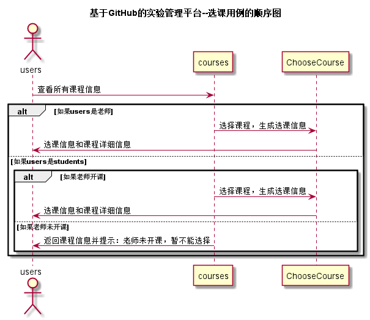

<!-- markdownlint-disable MD033-->
<!-- 禁止MD033类型的警告 https://www.npmjs.com/package/markdownlint -->

# “选课”用例 [返回](../README.md)
## 1. 用例规约

|用例名称|选课|
|-------|:-------------|
|功能|用户选择所需要完成的课程|
|参与者|学生，老师|
|前置条件|必须先登录|
|后置条件|显示用户的选课信息 |
|主事件流|1.用户登录系统 2.用户选择所需要完成的课程 3.系统生成选课信息表 4.系统显示用户的选课信息 |
|备选事件流| 2a.用户所选择的课程不存在 &nbsp;&nbsp;&nbsp;&nbsp;1.系统提示课程不存在，返回选课页面|

## 2. 业务流程（顺序图） [源码](../src/sequence选课.puml)

## 3. 界面设计
- 界面参照: https://d123456yy.github.io/is_analysis/test6/ui/选课.html
- API接口调用
    - 接口1：[setChooseCourses](../接口/setChooseCourses.md)

## 4. 算法描述
无

## 5. 参照表
- [STUDENTS](../数据库设计.md/#STUDENTS)
- [TEACHERS](../数据库设计.md/#TEACHERS)
- [USERS](../数据库设计.md/#USERS)
- [ChooseCourse](../数据库设计.md/#ChooseCourse)
- [COURSES](../数据库设计.md/#COURSES)